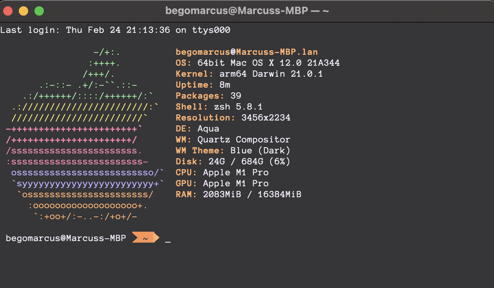

dotfiles
========

A collection of my personal dotfiles. 

Installation
------------
Your first step is to clone this repository:

    git clone https://github.com/viniciusgomes/dotfiles.git ~/.dotfiles

### Manual Installation
Create symbolic links for the configurations you want to use, e.g.:

    ln -s ~/.dotfiles/vim/.vimrc ~/.vimrc

### Using [GNU Stow](https://www.gnu.org/software/stow/) _(recommended)_
Install GNU Stow _(if not already installed)_

    Mac:      brew install stow
    Ubuntu:   apt-get install stow
    Fedora:   yum install stow
    Arch:     pacman -S stow

Then simply use stow to install the dotfiles you want to use:

    cd ~/.dotfiles
    stow vim
    stow tmux

Additional configuration
------------------------
Some of the configurations need additional setup or configuration. If that's the case you can find a `README.md` file in the application's directory. Make sure to take a look at it to see what else there is to do to make the configuration work on your system.